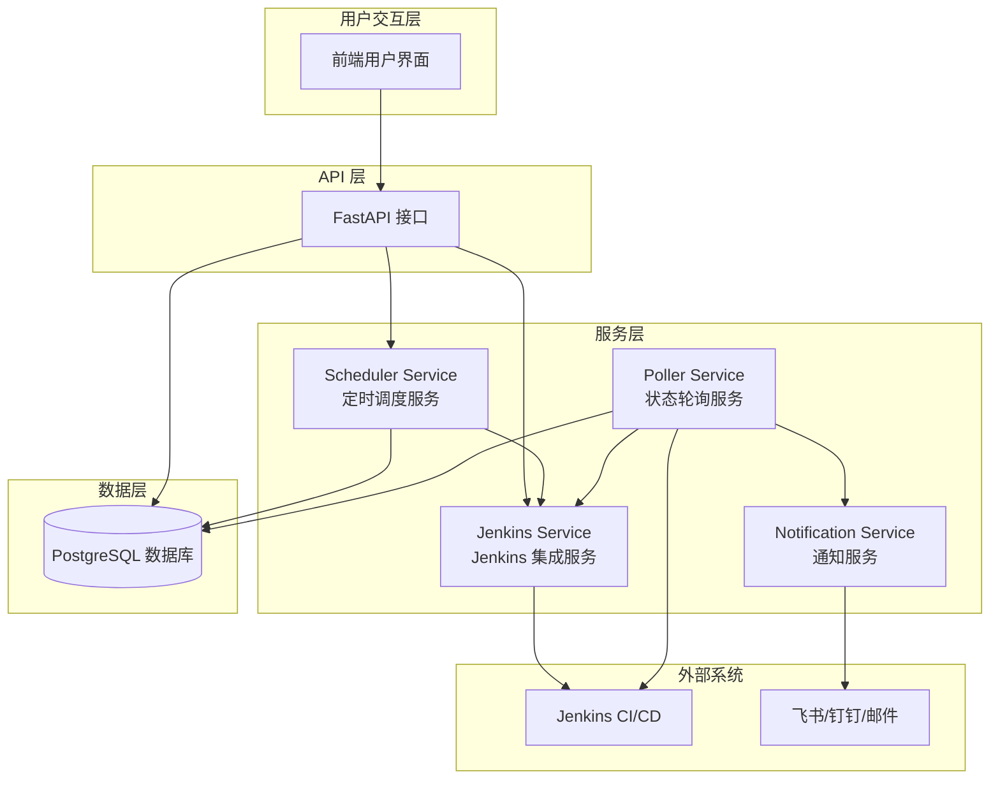
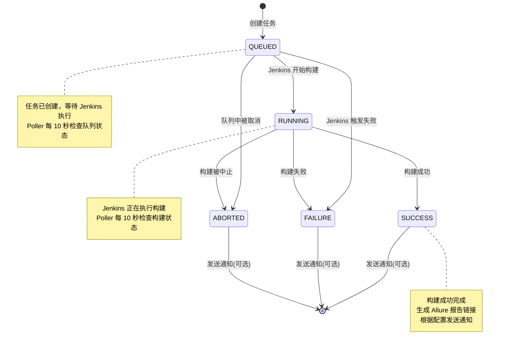
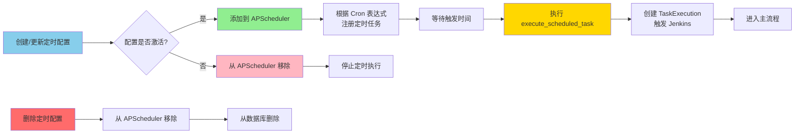
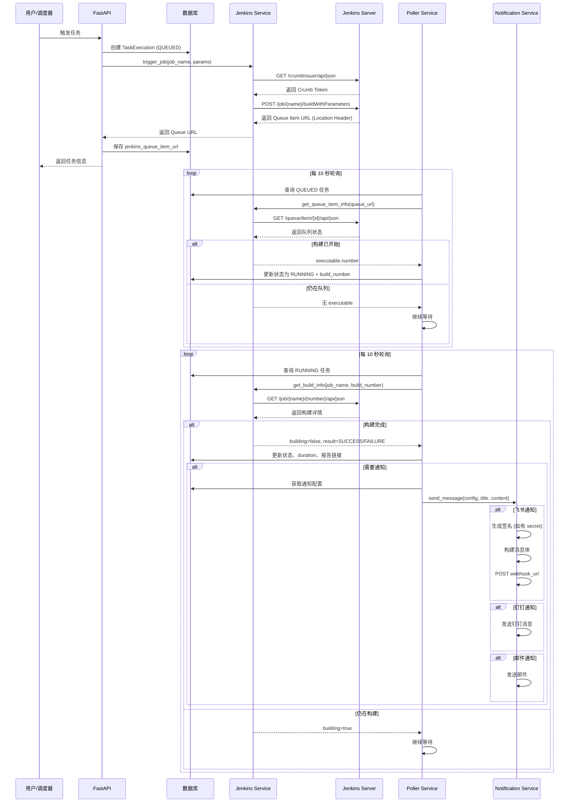
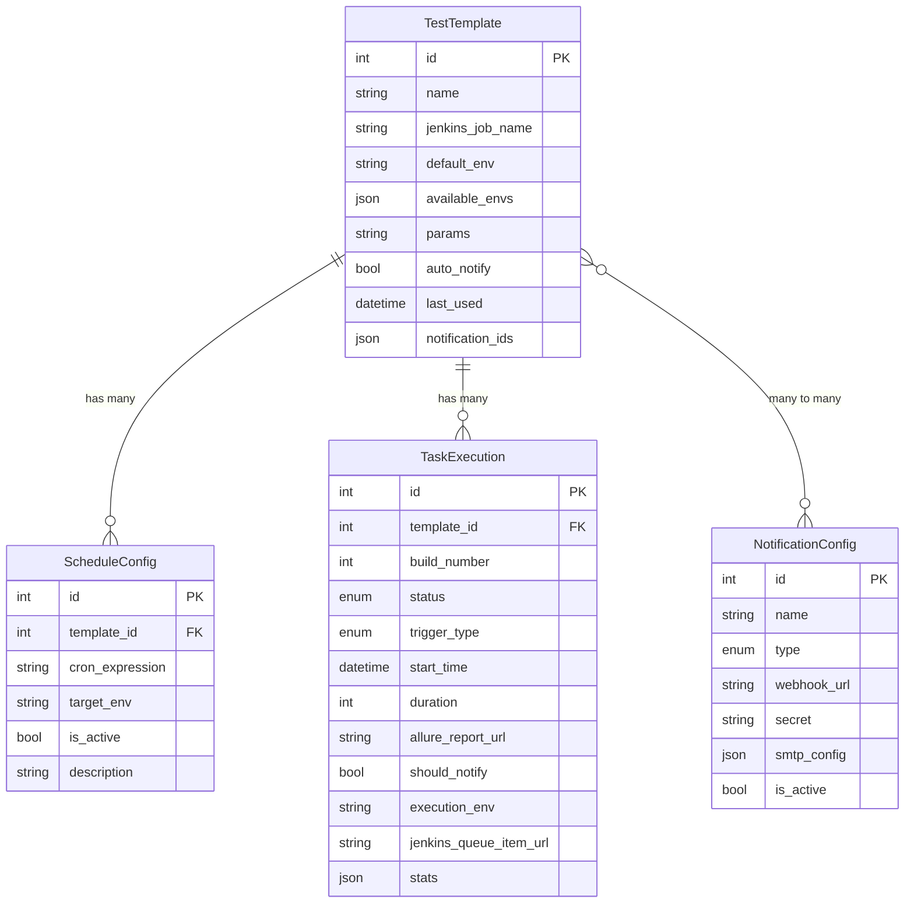

# TestFlow Pro 业务流程图

## 系统架构流程



## 完整业务流程图

```mermaid
flowchart TD
    Start([开始]) --> Choice{触发方式}

    %% 手动触发流程
    Choice -->|手动触发| Manual[用户点击执行按钮]
    Manual --> API1[POST /api/v1/dashboard/trigger]
    API1 --> GetTemplate[获取测试模板信息]
    GetTemplate --> CreateExec1[创建 TaskExecution 记录<br/>状态: QUEUED<br/>触发类型: MANUAL]

    %% 定时触发流程
    Choice -->|定时触发| Schedule[APScheduler 定时任务触发]
    Schedule --> CronCheck{Cron 表达式<br/>时间到达?}
    CronCheck -->|是| ScheduleExec[scheduler_service.execute_scheduled_task]
    ScheduleExec --> GetTemplate2[获取测试模板信息]
    GetTemplate2 --> CreateExec2[创建 TaskExecution 记录<br/>状态: QUEUED<br/>触发类型: SCHEDULE]

    %% 合并到 Jenkins 触发
    CreateExec1 --> TriggerJenkins[调用 Jenkins API]
    CreateExec2 --> TriggerJenkins

    TriggerJenkins --> GetCrumb[获取 Jenkins Crumb Token]
    GetCrumb --> BuildParams[构建参数<br/>env, 其他自定义参数]
    BuildParams --> PostJenkins[POST /job/{job_name}/buildWithParameters]

    PostJenkins --> JenkinsSuccess{Jenkins<br/>响应成功?}
    JenkinsSuccess -->|失败| UpdateFail[更新状态为 FAILURE]
    UpdateFail --> End1([结束])

    JenkinsSuccess -->|成功| SaveQueue[保存 Queue Item URL<br/>到 jenkins_queue_item_url]
    SaveQueue --> PollerStart[Poller Service 开始监控]

    %% Poller Service 轮询流程
    PollerStart --> PollerLoop{每 10 秒轮询}

    %% 处理 QUEUED 状态
    PollerLoop --> CheckQueued[查询所有 QUEUED 状态任务]
    CheckQueued --> HasQueueURL{是否有<br/>Queue URL?}

    HasQueueURL -->|有| GetQueueInfo[调用 Jenkins Queue API<br/>获取队列信息]
    GetQueueInfo --> QueueStatus{队列状态}

    QueueStatus -->|已开始构建| ExtractBuildNum[提取 Build Number]
    ExtractBuildNum --> UpdateRunning1[更新状态为 RUNNING<br/>保存 build_number]

    QueueStatus -->|已取消| UpdateAborted1[更新状态为 ABORTED]
    UpdateAborted1 --> End2([结束])

    QueueStatus -->|仍在队列中| WaitQueue[继续等待]
    WaitQueue --> PollerLoop

    QueueStatus -->|队列项不存在| FallbackCheck[回退检查: 获取最近构建]
    FallbackCheck --> MatchQueueID{匹配 Queue ID?}
    MatchQueueID -->|是| UpdateRunning2[更新状态为 RUNNING]
    MatchQueueID -->|否| WaitQueue

    HasQueueURL -->|无| LegacyCheck[旧逻辑: 检查最近构建时间]
    LegacyCheck --> TimeMatch{构建时间 ><br/>任务创建时间?}
    TimeMatch -->|是| UpdateRunning3[更新状态为 RUNNING]
    TimeMatch -->|否| WaitQueue

    %% 处理 RUNNING 状态
    UpdateRunning1 --> PollerLoop
    UpdateRunning2 --> PollerLoop
    UpdateRunning3 --> PollerLoop

    PollerLoop --> CheckRunning[查询所有 RUNNING 状态任务]
    CheckRunning --> GetBuildInfo[调用 Jenkins Build API<br/>获取构建详情]

    GetBuildInfo --> BuildStatus{构建状态}

    BuildStatus -->|仍在构建中| ContinueBuild[继续构建]
    ContinueBuild --> PollerLoop

    BuildStatus -->|SUCCESS| UpdateSuccess[更新状态为 SUCCESS<br/>保存 duration<br/>生成 Allure 报告链接]
    BuildStatus -->|FAILURE| UpdateFailure[更新状态为 FAILURE<br/>保存 duration<br/>生成 Allure 报告链接]
    BuildStatus -->|ABORTED| UpdateAborted2[更新状态为 ABORTED<br/>保存 duration]

    %% 通知流程
    UpdateSuccess --> CheckNotify{是否需要<br/>发送通知?}
    UpdateFailure --> CheckNotify
    UpdateAborted2 --> CheckNotify

    CheckNotify -->|否| End3([结束])
    CheckNotify -->|是| GetNotifConfig[获取通知配置列表]

    GetNotifConfig --> HasConfig{有配置?}
    HasConfig -->|否| End4([结束])
    HasConfig -->|是| LoopNotif[遍历通知配置]

    LoopNotif --> NotifType{通知类型}

    NotifType -->|飞书| SendFeishu[发送飞书消息<br/>包含: 任务名称、状态<br/>构建号、耗时、报告链接]
    NotifType -->|钉钉| SendDingTalk[发送钉钉消息<br/>包含: 任务名称、状态<br/>构建号、耗时、报告链接]
    NotifType -->|邮件| SendEmail[发送邮件通知<br/>包含: 任务名称、状态<br/>构建号、耗时、报告链接]

    SendFeishu --> CheckMore{还有其他<br/>通知配置?}
    SendDingTalk --> CheckMore
    SendEmail --> CheckMore

    CheckMore -->|是| LoopNotif
    CheckMore -->|否| End5([结束])

    %% 样式定义
    classDef startEnd fill:#90EE90,stroke:#333,stroke-width:2px
    classDef process fill:#87CEEB,stroke:#333,stroke-width:2px
    classDef decision fill:#FFD700,stroke:#333,stroke-width:2px
    classDef jenkins fill:#FF6B6B,stroke:#333,stroke-width:2px
    classDef notification fill:#DDA0DD,stroke:#333,stroke-width:2px

    class Start,End1,End2,End3,End4,End5 startEnd
    class Manual,Schedule,API1,GetTemplate,CreateExec1,CreateExec2,ScheduleExec,GetTemplate2 process
    class TriggerJenkins,GetCrumb,BuildParams,PostJenkins,SaveQueue jenkins
    class PollerStart,PollerLoop,CheckQueued,CheckRunning,GetQueueInfo,GetBuildInfo process
    class UpdateRunning1,UpdateRunning2,UpdateRunning3,UpdateSuccess,UpdateFailure,UpdateAborted1,UpdateAborted2,UpdateFail process
    class SendFeishu,SendDingTalk,SendEmail,GetNotifConfig notification
    class Choice,JenkinsSuccess,HasQueueURL,QueueStatus,MatchQueueID,TimeMatch,BuildStatus,CheckNotify,HasConfig,NotifType,CheckMore,CronCheck decision
```

## 任务状态流转图



## 定时调度管理流程



## Jenkins 集成详细流程



## 核心服务说明

### 1. Scheduler Service (定时调度服务)
- **职责**: 管理定时任务的创建、更新、删除和执行
- **技术**: APScheduler (AsyncIOScheduler)
- **触发器**: CronTrigger (支持标准 Cron 表达式)
- **关键方法**:
  - `add_job()`: 添加/更新定时任务
  - `remove_job()`: 移除定时任务
  - `execute_scheduled_task()`: 执行定时任务逻辑

### 2. Jenkins Service (Jenkins 集成服务)
- **职责**: 与 Jenkins API 交互
- **认证**: HTTP Basic Auth
- **关键方法**:
  - `get_jobs()`: 获取所有 Jenkins 任务列表
  - `trigger_job()`: 触发 Jenkins 构建 (支持参数化构建)
  - `get_build_info()`: 获取构建详情
  - `get_queue_item_info()`: 获取队列项信息

### 3. Poller Service (状态轮询服务)
- **职责**: 轮询 Jenkins 状态并更新任务状态
- **轮询间隔**: 10 秒
- **处理逻辑**:
  - **QUEUED 任务**: 检查队列状态，判断是否开始构建
  - **RUNNING 任务**: 检查构建状态，判断是否完成
- **关键方法**:
  - `_process_queued_tasks()`: 处理排队中的任务
  - `_process_running_tasks()`: 处理运行中的任务
  - `_trigger_notification()`: 触发通知

### 4. Notification Service (通知服务)
- **职责**: 发送任务完成通知
- **支持渠道**: 飞书、钉钉、邮件
- **通知内容**: 任务名称、构建号、状态、耗时、Allure 报告链接
- **关键方法**:
  - `send_message()`: 统一发送接口
  - `_send_feishu()`: 飞书通知 (支持签名验证)
  - `_send_dingtalk()`: 钉钉通知
  - `_send_email()`: 邮件通知

## 数据模型关系



## 关键业务规则

### 任务触发规则
1. **手动触发**: 用户通过 API 主动触发，立即创建 QUEUED 任务
2. **定时触发**: APScheduler 根据 Cron 表达式自动触发
3. **环境选择**: 优先使用请求参数中的环境，否则使用模板默认环境
4. **通知策略**: 优先使用请求参数中的通知设置，否则使用模板配置

### 状态轮询规则
1. **轮询间隔**: 固定 10 秒
2. **队列检查**:
   - 优先使用 Queue Item URL 精确查询
   - 回退方案: 通过时间戳匹配最近构建
3. **构建检查**: 通过 `building` 字段判断是否完成
4. **结果映射**: SUCCESS → SUCCESS, FAILURE → FAILURE, ABORTED → ABORTED

### 通知发送规则
1. **触发条件**: `should_notify = true` 且任务状态为终态 (SUCCESS/FAILURE/ABORTED)
2. **配置来源**: 从模板的 `notification_ids` 获取通知配置列表
3. **发送策略**: 遍历所有激活的通知配置，逐个发送
4. **失败处理**: 单个通知失败不影响其他通知发送

## 技术栈

- **后端框架**: FastAPI (Python)
- **数据库**: PostgreSQL + SQLModel
- **任务调度**: APScheduler
- **HTTP 客户端**: httpx (异步)
- **CI/CD 集成**: Jenkins REST API
- **通知渠道**: 飞书 Webhook、钉钉 Webhook、SMTP 邮件

---

**文档版本**: 1.0
**最后更新**: 2026-02-10
**平台名称**: TestFlow Pro - 自动化测试管理平台

文档内容包括：
📊 6 个核心流程图
系统架构流程图 - 展示各层级组件关系
完整业务流程图 - 详细的任务触发、执行、监控、通知全流程
任务状态流转图 - 状态机模型 (QUEUED → RUNNING → SUCCESS/FAILURE/ABORTED)
定时调度管理流程 - APScheduler 定时任务管理
Jenkins 集成详细流程 - 时序图展示各组件交互
数据模型关系图 - ER 图展示数据库表关系
📝 详细说明
4 个核心服务的职责和关键方法说明
关键业务规则：任务触发、状态轮询、通知发送
技术栈清单
🎯 流程亮点
✅ 支持手动触发和定时触发两种方式
✅ 使用 Queue Item URL 精确追踪 Jenkins 任务
✅ 10 秒轮询机制实时更新任务状态
✅ 支持飞书/钉钉/邮件多渠道通知
✅ 自动生成 Allure 测试报告链接